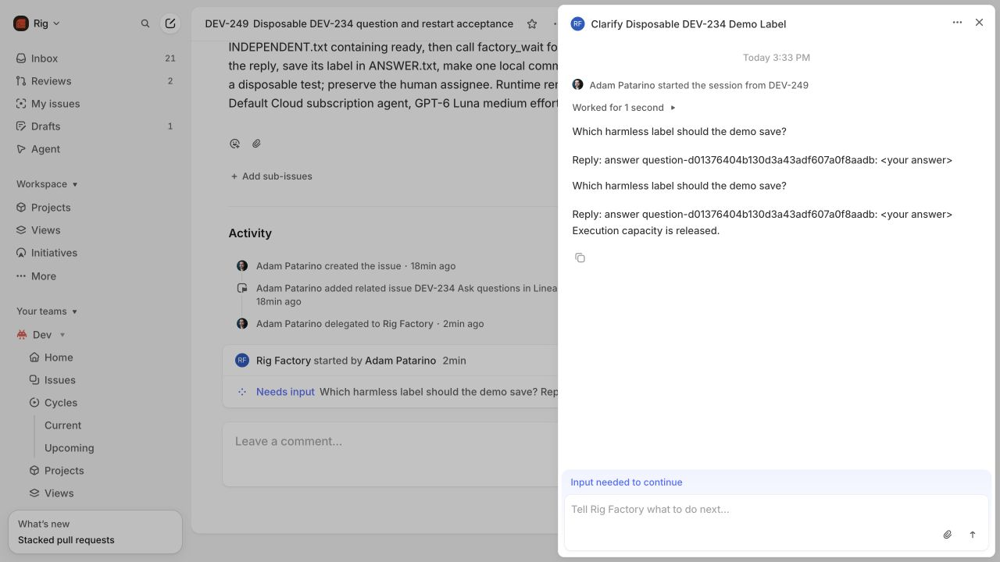
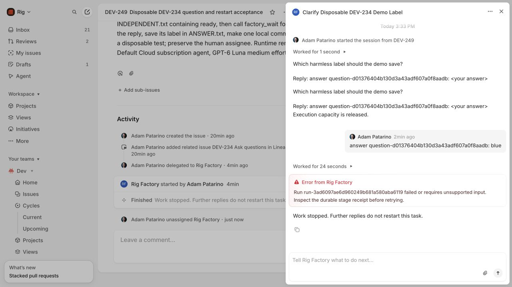

# DEV-234 question and reply acceptance

The question, released worker slot, coordinator restart, native reply and one
same-stage continuation were observed on the scoped GCP pilot. The saved answer
was correct. The demo's later candidate check failed because the worker sandbox
made `.git` read-only, preventing its requested local commit. This record does
not claim a successful candidate commit or publication.

Live duplicate replay was **not executed**: automatic approval review rejected
sending the captured signed webhook to the public endpoint without specific
approval. The original signature then expired. Duplicate/restart behavior passed
controlled tests; those tests are not a live duplicate-delivery result.

## Scope and deployed versions

The coordinator stores questions before publishing native elicitation, handles
authenticated human prompts, and delivers replies once by provider activity ID.
A wait stops its contained operation before releasing capacity. Continuation
starts a fresh app-server thread with pinned stage context, saved input and the
same workspace. Old JSON-RPC request IDs are not replayed. Trusted approval waits
require an explicit current artifact digest.

- Coordinator source: `4ea729c6bb1b44e379161ea3543e68086cdbd1e6`.
- Coordinator release archive SHA-256:
  `9232e8ef3100e9abe779fdc9ac7f279c4424d4365fece95a6b38988d61c5a616`.
- Worker broker unchanged: `064f892f95847ea2eed0eb684da36c6e1bb5fce6`, archive
  `67267e73e9c587f0b6115398d89cdac462b23dcb8749df34895a34b9d0a0af89`.
- Worker application unchanged: `541279aeb6a5366571e1ee8935e134c728d91c63`.
- Runtime: qualified Default Cloud, GPT-6 Luna medium, Daybreak off, subscription
  authentication; no API billing fallback.

[Deployment receipts](deployment.json) record activation and protected config
permissions. Existing IAP/SSH access staged the release directly. No IAM, budget,
billing, VM or endpoint change was made. Recovery with the release disk absent
was not qualified.

## Live demo

[DEV-249](https://linear.app/rigai/issue/DEV-249/disposable-dev-234-question-and-restart-acceptance)
remained owned by Adam and in Backlog. Matching dedicated clones came from Rig
seed `39d6d5d998366bf13af19eb74ae47d598ecf92bd`, branch
`cycle/dev-249-disposable`, with push URLs `DISABLED`. Other disposable clones
were preserved. Factory publication remained disabled throughout.

The native session is `b3fce47a-584d-4364-a138-8e01ea95358e`; the durable run is
`run-3ad6097ae6d960249b681a580aba6119`. It asked one durable question,
`question-d01376404b130d3a43adf607a0f8aadb`: “Which harmless label should the demo
save?” Linear displayed an initial elicitation and a separate waiting-state
elicitation stating that execution capacity was released.

1. At 19:33 UTC the native task started. It wrote `INDEPENDENT.txt` containing
   `ready` before waiting. [Waiting observation](observed-waiting.json) showed no
   worker processes and no running tasks.
2. The coordinator was stopped, its persisted state inspected, and restarted
   while waiting. [Durable wait audit](wait-restart.json) records the exact broker
   termination proof: matching operation identity, `main_pid: 0`, released cgroup
   and `cgroup_populated: 0`. [After restart](observed-after-restart.json), the run,
   question, stage and native session were unchanged.
3. At 19:36 UTC the reply `answer <question-id>: blue` was submitted through the
   native agent chat. [Resume audit](resume-audit.json) records one accepted
   provider activity, `dcc1a30f-00fa-4283-a942-d01d602372f3`, and exactly one
   continuation, `implement/2`. The original question remains linked to
   `implement/1`; its active attempt is `implement/2`. The fresh app-server thread
   was `01a12751-36ef-7cd3-839d-133f7f84e08d`, following the original
   `01a1274e-e268-7e60-b4ca-546a009f1875`.
4. [Resumed observation](observed-resumed.json) verified `ANSWER.txt` contained
   `blue`. The subsequent real Git check failed. [Agent report](worker-diagnosis.json)
   identifies the read-only `.git/index.lock` boundary; the files remained
   uncommitted. Linear displayed the error. No approval or sandbox permission was
   broadened to make that check pass.
5. Delegation was removed. The native conversation displayed “Work stopped.
   Further replies do not restart this task.” [Stop audit](stopped-audit.json)
   and [final observation](observed-stopped.json) retain termination receipts for
   both agent attempts and the failed check, with no live worker processes.
6. The temporary observer stopped and seven expired raw capture bodies/signatures
   were removed. [Cleanup receipt](capture-cleanup.json) retains only event
   metadata. Workspaces and Codex conversations were preserved.

## Acceptance boundaries

| Behavior | Evidence |
| --- | --- |
| Native question, independent work, released slot and reply | Live DEV-249 observations and screenshots |
| Restart while waiting; one same-stage continuation | Live durable audits; real app-server terminated and fresh thread started |
| Reply during an active turn survives coordinator restart | Controlled OTP coordinator test in `linear_delegation_test.exs` |
| Duplicate delivery/activity and conflicting activity bodies | Controlled coordinator/client/webhook tests; live replay not executed |
| Progress, failure and stop visible; agent output does not create replies | Live native conversation; signed agent-output rejection tests |
| Stale stage/artifacts and ordinary clarification cannot approve | Controlled run and coordinator tests |
| Current artifact digest required for trusted approval | Controlled run/schema tests |
| Multiple questions and saved input survive transport retry | Controlled run/runner tests |
| Permission, secret and unsupported multi-question requests block | Controlled app-server tests |

## Local checks

Checks ran in isolated `dev234-check`, Elixir 1.19.5 / OTP 28, with the existing
cache. This source checkout has no host Elixir runtime. Commands ran from
`/workspace/elixir` after copying the final source, tests and factory fixtures:

- `mix compile --warnings-as-errors`: passed.
- `mix specs.check`: passed.
- Focused question/client/webhook/coordinator/runner/run suites: 167 tests passed;
  follow-up run/runner/delegation suites: 54 passed; webhook checks: 17 passed.
- `mix test`: [520 tests, zero failures](tests-final.log), six skipped, ten excluded.

Broad CI was run and reviewed under the root AGENTS alpha exception. It is not
fully green:

- [`make all`](all.log) stopped on Credo style/complexity findings after format,
  build and specs checks passed.
- [`mix dialyzer`](dialyzer.log) reported three warnings: the added defensive
  `valid_wait_outputs?/2` catch-all is inferred unreachable; two existing warnings
  are in `workstream_store.ex`.
- [`mix test --cover`](coverage.log) reported 77.42% against the 100% threshold and
  initially lacked the factory fixture in the container. The fixture was copied,
  its affected test passed, and the final full `mix test` run passed as recorded
  above. Coverage was not rerun or claimed passing.

## Self-review and remaining verification

The review checked session/activity identity, reply commit/replay ordering,
worker/attempt callback authorization, termination before releasing capacity, and
clarification/approval separation. Regression tests cover two data-loss risks
found during implementation: a second question after same-stage continuation,
and saved input lost before a successful transport retry. No mandatory general
independent review was added under the alpha guidance.

A fresh signed live duplicate-delivery test still requires explicit approval for
the replay payload and destination. The disposable candidate-commit boundary is
also unqualified with the current read-only Git sandbox. Neither is hidden by
the successful question/restart/resume result. DEV-234 is not marked Done and no
PR is merged by this change.
